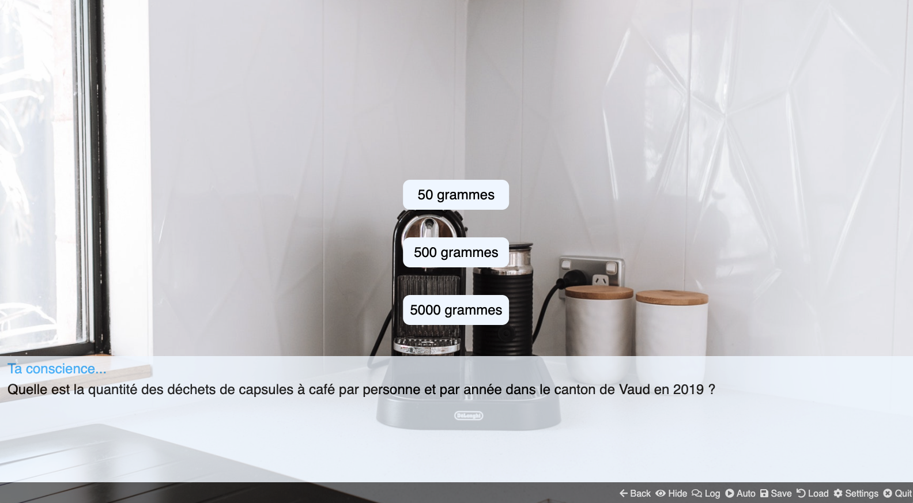

# Custom Ride

Cette fiction interactive s'est construite dans le cadre du cours [Développement de Jeux Vidéo 2D](https://github.com/ipante/ressources_cours_jeux_video_2D/blob/master/README.md), enseigné par Isaac Pante à l'Université de Lausanne. 

## Concept
Alter'Eco a pour simple but de rendre l'utilisateur attentif sur des façons de vivre plus écologiques et saines. Pour ce faire, l'utilisateur est soumis à des questions sur la consommation en Suisse, et conséquemment sur la production des déchets. Chaque question souligne l'ampleur qu'un seul comportement peut avoir sur la santé de la Terre. Une fois que l'utilisateur a répondu, la solution correcte est donnée. Mais, surtout, une alternative facile et locale est proposée à l'utilisateur. 

Par ce biais, l'objectif est de faciliter l'accès à d'autres modes de fonctionnement pour l'utilisateur. Ici, les solutions sont à portées de mains et sont bénéfiques à tous ceux qui désirent faire un geste.

## Bibliographie

1. [Informations sur les déchets de capsules à café dans le canton de vaud en 2019](https://www.vd.ch/fileadmin/user_upload/themes/environnement/dechets/fichiers_pdf/Statistiques_communales_des_d%C3%A9chets_urbains_-_Ann%C3%A9e_2019.pdf) 
2. [Émissions de gaz carbonique issues de l'industrie textile](https://www.wwf.ch/fr/nos-objectifs/rapport-du-wwf-sur-lindustrie-de-lhabillement-et-des-textiles) 
3. [Statistiques de l'OFS sur la mobilité de la population en Suisse](https://www.bfs.admin.ch/bfs/fr/home/statistiques/mobilite-transports/transport-personnes/pendularite.html)
4. [Statistiques du WWF sur le gaspillage alimentaire en Suisse]( https://www.wwf.ch/fr/nos-objectifs/gaspillage-alimentaire)
5. [Statistiques de la consommation de plastique comme emballage en Suisse](https://www.swissinfo.ch/fre/la-majorité-des-produits-bio-sont-vendus-dans-du-plastique/45103296)

## Autrice
Rebecca Kneubuehler
### Contact
Rebecca.Kneubuehler@unil.ch

## Logiciel
[Monogatari](https://monogatari.io/)

## Contribution
### Musiques et sons
Tous les bruits sonores et les musiques sont issus de la bibliothèque audio de YouTube, accessible via le YouTube Studio, et sont donc libres de droit. 

### Images
Toutes les images ont été extraites de Canva Premium [Canva](https://www.canva.com/), ainsi que de [Freepik](https://fr.freepik.com/).
Les personnages ont été réalisé gratuitement à l'aide de [Scratch](https://scratch.mit.edu/).

### Sources
Scene 3 : [Freepik](https://fr.freepik.com/photos-gratuite/concept-magasin-service-velo-velo_13659193.htm#fromView=search&page=1&position=46&uuid=d8cb5e66-87cf-41da-b60a-396f2b92d95c).